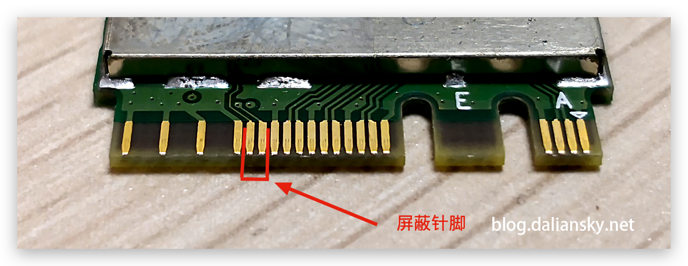

# m90n-1-Ventura-OC
A hackintosh efi for lenovo m90n-1 for ventura with fully working wifi, bluetooth, etc
Theres no need to edit anything, this is built for ventura 13.1 and its a fork of https://github.com/alexleisyd/lenovo-m90n-hackintosh, I just update it to ventura and fixed wifi without needing to change wifi card.

This efi is for open core only do not try using any other bootloader.

In the future I plan to continuously upgrade this project, feel free to fork it and add your own spice to the mix!

### Specs

| Component           | Details                                                   |
| ------------------- | --------------------------------------------------------- |
| Computer model      | Lenovo ThinkCentre M90n-1 (Model # 11AD000HAU)            |
| Processor           | i5-8265U                                                  |
| Memory              | 8GB DDR4-2666 Soldered                                    |
| Disk 1              | Samsung PM981a NVMe m.2 SSD 256GB (For Windows)           |
| Disk 2              | WD SN750 NVMe m.2 SSD 500GB (For Mac)                     |
| Integrated Graphics | Intel UHD Graphics 620                                    |
| Sound Chips         | Realtek ALC233                                            |
| Wireless/BT         | Intel 9560NGW                                             |

### Credits

@alexleisyd for the original project which I forked

### Disclaimer!

While wifi, bluetooth and etc are working AirDrop does not work. If you need airdrop then I recommend changing the wifi card, from there do your own research as I do not own another wifi card, if you are going to use the DW1820A then you need to use pin masking, follow the images under this to see which pins you need to mask. (These images come from Alexleisyd's github page)

